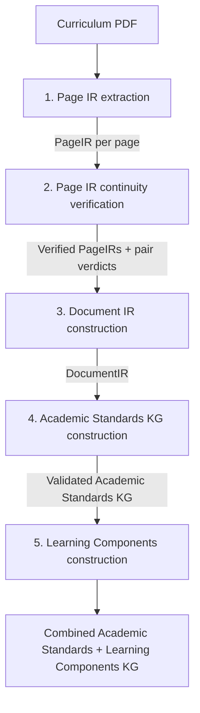
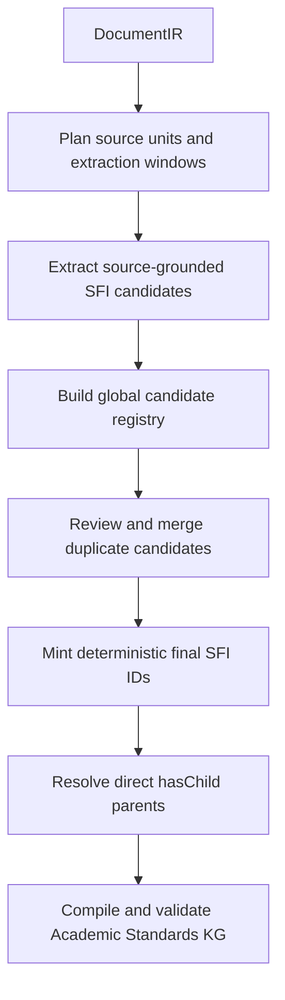
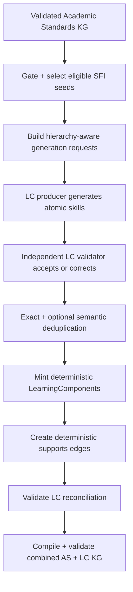

# Architecture

This page describes the architecture of the curriculum-document processing pipeline in
this repository. The pipeline transforms curriculum PDFs into source-grounded,
[Learning Commons-shaped knowledge graph](https://docs.learningcommons.org/knowledge-graph/understanding-knowledge-graph/introduction)
artifacts while preserving provenance and separating document reconstruction from
curriculum-semantic interpretation.

The implementation is document- and profile-driven. Example runtime configurations in
this repository cover curricula from Ghana, Nigeria, Rwanda, and India; the same
pipeline
is intended to support additional curriculum documents through configuration rather
than country-specific code paths.

---

## Overview

The production pipeline has **five conceptual stages implemented through four main CLI
entry points**:



| Stage                              | Main CLI entry point                                   | Primary input                                            | Primary output                         |
|------------------------------------|--------------------------------------------------------|----------------------------------------------------------|----------------------------------------|
| Page IR extraction                 | `backend/src/kgfeg/entries/extract_page_ir.py`         | Curriculum PDF                                           | One `PageIR` JSON per page             |
| Page IR continuity verification    | `backend/src/kgfeg/entries/verify_page_ir_continuity.py` | Page images + extracted `PageIR`s                        | Verified `PageIR`s + boundary verdicts |
| Document IR construction           | `backend/src/kgfeg/entries/stitch_document_ir.py`        | Verified `PageIR`s + verification evidence               | `document_ir.json`                     |
| Academic Standards KG construction | `backend/src/kgfeg/entries/create_kgs.py`                | `DocumentIR` + `kgs.as` configuration                    | Academic Standards KG artifacts        |
| Learning Components construction   | `backend/src/kgfeg/entries/create_kgs.py`                | Validated Academic Standards KG + `kgs.lc` configuration | Combined AS + LC KG artifacts          |

The first three stages reconstruct the source document with progressively broader
context. The final two stages perform curriculum-semantic interpretation and knowledge
graph construction.

---

## Core design principles

### Preserve source fidelity before adding semantics

`PageIR` and `DocumentIR` are intentionally layout- and document-oriented. They preserve
what is visible in the source, how content is arranged, and how content continues across
pages without deciding that an item is a grade, strand, objective, competency, or other
curriculum-semantic entity.

Curriculum semantics are first asserted during **Academic Standards KG construction**.
Learning Components are then derived from the validated Academic Standards graph rather
than independently reinterpreting the PDF.

### Bound LLM decisions

LLMs are used for judgments that require visual or semantic interpretation, but the
pipeline constrains the evidence supplied to each task. Examples include:

- one rendered PDF page for Page IR extraction;
- a bounded pair of candidate items around an adjacent-page boundary for continuity
  verification;
- a bounded `DocumentIR` extraction window for Standards Framework Item extraction;
- a bounded duplicate-candidate set for SFI deduplication;
- a bounded candidate-parent set for `hasChild` resolution; and
- one or a small batch of eligible standards plus resolved hierarchy context for
  Learning Component generation.

The pipeline does not ask an LLM to infer an unconstrained whole-document graph in a
single step.

### Keep deterministic invariants in Python

Python owns the pieces that should not depend on model judgment. Depending on the
stage, this includes:

- schema validation;
- page coordinates and bounding-box constraints;
- page-level boundary-state derivation;
- verification confidence gates;
- deterministic stitching and complete source-item consumption;
- source-window planning and candidate registries;
- graph endpoint, cardinality, reachability, and cycle checks;
- deterministic UUIDv5 identities for finalized graph entities and relationships;
- run-level coverage and reconciliation checks; and
- serialization of final graph artifacts.

A model judgment therefore must pass stage-specific validation and, where applicable,
confidence and graph-integrity gates.

### Use independent semantic checking where the assertion risk is highest

Several higher-risk semantic operations use a **producer/checker** pattern: one LLM
produces a structured semantic judgment and an independent checker validates or
corrects it. This pattern is used for source-grounded SFI extraction, SFI duplicate
resolution, `hasChild` parent selection, and Learning Component decomposition.

Learning Component semantic deduplication is intentionally different: deterministic
blocking nominates bounded candidate pairs for one semantic judge, while Python owns
request coverage, retries, conflict-aware clustering, deterministic canonicalization,
and final graph reconciliation.

### Treat provenance and intermediate artifacts as first-class outputs

The pipeline persists intermediate decisions rather than retaining only the final graph.
Source page indexes, segment identities, extraction windows, candidate identities,
merge decisions, hierarchy decisions, LC claims, unresolved items, and validation
reports remain inspectable after a run.

These artifacts support:

- source tracing and audit;
- debugging individual decisions;
- resumable processing;
- deterministic reruns where applicable; and
- downstream review of unresolved or excluded material.

---

## Runtime configuration and run layout

A pipeline run is configured through a single `RunConfig`. Its top-level namespaces
mirror the major stages:

```text
page_ir_extraction
page_ir_verification
document_ir
kgs
  as   # Academic Standards
  lc   # Learning Components
```

The KG section is optional at the `RunConfig` schema level, allowing the extraction,
verification, and stitching stages to be used without constructing a KG.

For a source PDF, the pipeline computes a stable document key and stores stage outputs
under that document-specific result directory. The main stage directories are:

```text
<output_dir>/<doc_key>/
├── extraction/
├── verification/
├── stitching/
└── kgs/
```

Each stage cross-checks relevant upstream artifacts before proceeding so outputs from a
different source document or incompatible run are not silently combined.

---

## Stage 1: Page IR extraction

**Purpose:** Convert each rendered PDF page into a structured, layout-faithful
`PageIR` while keeping curriculum semantics light.

The extraction entry point renders each selected PDF page to PNG and invokes the Page IR
extraction pipeline on the image. When enabled, text-layer and table-layer information
extracted with PyMuPDF can be supplied as additional hints. Those hints assist the
vision model but do not replace the rendered page as the visual source of truth.

A `PageIR` can contain ordered structures such as:

- text blocks and headings;
- lists;
- tables and table cells;
- figures and captions;
- bounding boxes in page-image coordinates;
- local codes where visibly present; and
- item-level page-boundary hints such as complete, truncated, resumed, or both.

The page-level boundary state is computed deterministically from the item-level states;
it is not directly inferred by the LLM.

Extraction includes both deterministic quality checks and an LLM validation/correction
flow. Validators check structural properties such as bounding boxes, reading order,
table integrity, figure plausibility, artifacts, text constraints, and continuity-state
consistency. Structured-output failures can be retried before a Page IR is accepted.

Typical persisted artifacts include:

```text
extraction/
├── extraction_run.json
├── page_images/
├── page_irs/
└── page_irs_raw/
```

**Stage boundary:** Page IR extraction records what is visible on an individual page. It
does not construct the document-wide curriculum hierarchy or graph relationships.

---

## Stage 2: Page IR continuity verification

**Purpose:** Determine whether selected items at the bottom of page `N` continue into
selected items at the top of page `N+1`, then conservatively patch Page IR continuity
metadata when the evidence is strong enough.

This is specifically a **cross-page continuity verification stage**. It is not a generic
second extraction pass over each page.

For each adjacent page pair, deterministic logic builds a bounded candidate set around
the page break. Candidate families are kept structurally compatible where appropriate,
for example table-to-table or viable block-to-block comparisons. Pair-specific image
crops and compact structured excerpts are then supplied to the continuity verifier.

Existing extraction continuity hints are stripped from the candidate evidence sent to
the verifier so the model independently evaluates the boundary rather than simply
repeating Stage 1.

The semantic flow is:

```text
bounded candidate pair
        |
        v
continuity verifier
        |
        v
independent validator
        |
        v
selected pair verdict
        |
        v
confidence-gated compile + postprocess
```

Verification configuration distinguishes several confidence concepts. In particular,
a positive verdict may be good enough to win candidate selection without being strong
enough to modify canonical Page IR boundary state. Only verdicts meeting the configured
patch threshold are applied automatically.

The compile and postprocessing steps can also reconcile item boundary states, propagate
compatible local table codes, patch repeated-header information, and normalize verified
tables while preserving conflicts for inspection rather than silently overwriting them.

Typical persisted artifacts include:

```text
verification/
├── verification_run.json
├── page_irs_pair_crops/
├── page_irs_pair_reports/
├── continuity_compile_report.json
└── page_irs_verified/
```

**Stage boundary:** Verification decides cross-page continuity. It does not infer
curriculum-semantic hierarchy.

---

## Stage 3: Document IR construction

**Purpose:** Deterministically stitch verified page-local structures into one
source-faithful `DocumentIR`.

The stitcher first normalizes page items, then computes cross-page links from verified
boundary evidence and bounded deterministic heuristics. Confirmed continuation chains
are materialized as document-level segments.

For text and list content, stitching can merge continuation chains and repair page-break
hyphenation. For tables, the pipeline can reconstruct multi-page table structure,
normalize repeated headers, align row and column structure, and optionally fill down
leading grouping columns when the configuration explicitly permits it.

The stage also maintains lightweight document context such as section paths derived from
nearby headings and preserves provenance back to the contributing Page IR items and page
indexes. Segment identities are deterministic.

A critical invariant is that every normalized source item must be consumed exactly once
by the resulting document segments.

Typical persisted artifacts are:

```text
stitching/
├── stitching_run.json
├── document_ir.json
└── stitch_report.json
```

`DocumentIR` is the downstream source representation for KG construction, but it is
**not** a canonical curriculum hierarchy. It remains intentionally document-oriented:

- it does not decide curriculum statement types such as Strand, Competency, or
  Performance Objective;
- it does not assign final Standards Framework Item identities;
- it does not create `hasChild` or `supports` relationships; and
- it does not generate Learning Components.

Those responsibilities begin in the KG stage.

---

## Stage 4: Academic Standards KG construction

**Purpose:** Convert source-grounded `DocumentIR` evidence into a validated Academic
Standards graph containing a `StandardsFramework`, finalized `StandardsFrameworkItem`s,
and `hasChild` relationships.

This is the first stage that performs curriculum-specific semantic interpretation. Its
behavior is configured under `kgs.as`, including source-facing statement types, code
policies, identity scope, grade mapping, table inclusion rules, hierarchy policies, and
curriculum-specific producer/checker instructions.

Academic Standards construction is a multi-phase process:



### Source-window planning

The pipeline deterministically selects and bounds the `DocumentIR` evidence supplied to
SFI extraction. Text blocks and eligible table content are converted into LLM-ready
windows with bounded heading, section, table, and scope context. Table inclusion and
chunking are controlled by curriculum configuration rather than sending every table
blindly to the model.

### SFI extraction and validation

An extraction producer identifies source-grounded SFI candidates from each window. An
independent checker validates or corrects the extraction using the same bounded source
evidence plus curriculum-specific validation instructions.

Candidates retain explicit source anchors rather than becoming detached semantic
summaries.

### Global identity and deduplication

Window-local candidates are assembled into a global candidate registry before final
identities are minted. Deterministic keys and configured identity/code scopes nominate
possible duplicates and conflicts. Bounded duplicate review sets are semantically
adjudicated through a producer/checker flow.

The pipeline distinguishes accepted merges from conflicts and review-needed cases rather
than silently forcing ambiguous candidates into one identity.

### Finalization and `hasChild` resolution

Eligible merge groups are finalized with deterministic UUIDv5 SFI identities.

For each finalized SFI, Python constructs a bounded parent-candidate set from source
provenance, codes, configured hierarchy policy, active source context, and other
structured evidence. A producer chooses the supported direct parent and an independent
checker validates the judgment.

The resulting graph is then checked for constraints such as:

- valid endpoints;
- allowed direct-parent statement types;
- configured parent cardinality;
- duplicate edges;
- self-loops;
- directed cycles; and
- framework-root reachability.

The stage exports both final graph artifacts and the intermediate evidence needed to
audit extraction, deduplication, finalization, and hierarchy resolution.

Representative outputs include:

```text
kgs/
├── kg_run.json
├── kg_run_manifest.json
├── sfi_extraction_window_plan.json
├── sfi_extraction_windows.jsonl
├── sfi_extraction_results.jsonl
├── sfi_candidate_registry.json
├── sfi_merge_report.json
├── sfi_final_records.json
├── has_child_candidate_parent_sets.jsonl
├── has_child_edges_final.json
├── as_validation_report.json
├── as_unresolved_items.json
├── as_entity_provenance.json
├── as_standards_framework.json
├── as_standards_framework_items.jsonl
├── as_relationships_has_child.jsonl
└── as_kg_bundle.json
```

**Stage boundary:** Learning Component generation begins only after the Academic
Standards bundle has been compiled and checked. Unresolved Academic Standards material
is surfaced explicitly and influences LC eligibility/context handling.

---

## Stage 5: Learning Components construction

**Purpose:** Derive atomic, reusable Learning Components from eligible finalized
Standards Framework Items and connect them back to their source standards through
`supports` relationships.

LC behavior is configured under `kgs.lc`. The Academic Standards graph is authoritative
for seed text and hierarchy context; this stage does not independently re-extract skill
content from the original PDF.

The LC flow is:



### Eligibility and hierarchy context

The LC phase first requires a passed, error-free Academic Standards validation report.
Recorded AS finalization gaps can coexist with a valid bundle, so the default behavior
is to continue over the resolved subgraph while excluding seeds whose ancestry crosses
an unresolved root-fallback edge.

If `lc_source_statement_types` is configured, those exact source-facing statement types
define eligibility. Otherwise the deterministic fallback selects leaf SFIs whose
normalized statement type is `Standard`. Every exclusion receives an explicit reason.

Eligible seeds are batched by `lc_request_batch_size`. Each request contains the
framework context and, per seed, the authoritative description, language, statement
type, complete direct-parent UUID set, and ancestor graph. The hierarchy is explicitly
multi-parent: all branches are walked to the framework root, and each ancestor preserves
its own `parent_uuids` instead of being flattened into a single inferred path.

Sibling context can optionally be included for disambiguation and overlap avoidance,
but it cannot license new skill content. Statement codes are omitted from decomposition
input. If a reviewed override admits a seed with unresolved ancestry, the request is
marked `unresolved_ancestor_path` and the seed text becomes the sole authority for
curriculum scope.

### Atomic-skill producer/checker flow

The LC producer decomposes every requested SFI into one or more atomic teachable skills.
An already atomic seed can correctly produce one skill. The generic policy prevents
fragments, unstated prerequisites, activities/resources/assessment prompts, and
combinatorial splitting. When a seed names several actions over several objects or
cases, decomposition splits on one axis only rather than producing an N-by-M cross
product.

Python validates universal response integrity and any configured skill-count or
skill-text bounds. A separate LC generation validator then receives the original request
and the complete producer draft. It independently re-decomposes the seed and checks
semantic granularity, wording fidelity, split axis, scope, sibling leakage, language,
and runtime curriculum policy.

A passing verdict accepts the producer draft. A failing verdict must return a complete
corrected response, which Python validates again. The phase persists producer drafts,
validator verdicts, and accepted/corrected final responses separately, allowing the
semantic decision path to be audited and safely resumed.

Isolated request failures are recorded and processing continues. The run raises only
when the fraction of affected eligible SFIs exceeds `lc_max_failure_rate`.

### Deduplication and canonicalization

Exact LC identity normalization is deliberately language-independent: lowercase,
whitespace collapse, and trailing-period removal. Exact duplicates group within the
configured scope even if semantic deduplication is disabled.

When semantic deduplication is enabled, deterministic blocking nominates plausible text
pairs using token overlap, containment, character trigrams, generated tags,
corpus-frequency stopword suppression, and small shared-parent neighborhoods. An
optional profile-defined language pack adds stopwords and affix folding for nomination
only; these transformations never enter canonical LC identity.

The supported scope modes are:

- `framework`: one document-wide merge scope;
- `top_ancestor`: the complete set of resolved root-level SFI ancestors;
- `parent`: the complete set of direct parent UUIDs; and
- `none`: one isolated scope per source SFI.

Under `top_ancestor` or `parent`, empty or unresolved ancestry falls back to the seed
UUID, preventing unreliable hierarchy from enabling a cross-seed merge. Multi-parent
seeds key on the complete relevant set rather than allowing one branch to determine
scope.

Nominated pairs are adjudicated by one bounded semantic judge. SAME links are clustered
deterministically, while explicit DISTINCT verdicts prevent transitive chaining from
silently joining contradictory pairs. Dropped links are recorded as conflicts.
Canonical normalized text is elected deterministically by claim count, then text length,
then lexical order.

### Finalization, `supports`, and validation

Each canonical skill mints a content-addressed UUIDv5 `LearningComponent` using the
document key, dedup scope, and canonical normalized text. The displayed description is
a deterministic representative original surface form; identity remains tied to the
canonical normalized content.

Learning Components retain per-claim provenance and aggregate source/framework
provenance. Claiming SFIs must agree on inherited attribution metadata. Each LC is then
linked to every claiming SFI by one deterministic primary `supports` relationship. When
one SFI contributed several merged wordings to an LC, `support_confidence` is the
minimum of those claim confidences.

Run-level LC validation checks deterministic identifiers, real relationship endpoints,
unique LC/SFI support pairs, LC edge coverage, and exact eligible-SFI reconciliation:
every eligible SFI must be claimed by an LC or formally recorded as failed, but never
both or neither.

The final merge validates the complete graph again for the Academic Standards gate,
`supports` endpoints and counts, identifier collisions, LC provenance presence, and
summary alignment.

Representative outputs include:

```text
kgs/
├── lc_eligible_sfis.json
├── lc_eligibility_report.json
├── lc_generation_requests.jsonl
├── lc_generation_draft_responses.jsonl
├── lc_generation_validation_verdicts.jsonl
├── lc_generation_responses.jsonl
├── lc_generation_failures.json
├── lc_dedup_candidate_pairs.jsonl
├── lc_dedup_verdicts.jsonl
├── lc_dedup_groups.json
├── learning_components.jsonl
├── lc_supports_edges.json
├── lc_entity_provenance.json
├── lc_generation_summary.json
├── as_lc_kg_bundle.json
├── as_lc_nodes.jsonl
└── as_lc_relationships.jsonl
```

---

## Knowledge graph model

The current build pipeline produces three primary entity types.

### `StandardsFramework`

The root curriculum/framework entity for the processed document.

### `StandardsFrameworkItem`

Source-grounded curriculum items. Depending on the configured source framework, these
can represent both organizational/grouping structures and normative learning statements.
The source-facing `statement_type` remains curriculum-specific, while normalized fields
provide cross-framework interoperability where appropriate.

Academic Standards hierarchy is represented as:

```text
(:StandardsFramework)-[:hasChild]->(:StandardsFrameworkItem)
(:StandardsFrameworkItem)-[:hasChild]->(:StandardsFrameworkItem)
```

### `LearningComponent`

An atomic skill or concept derived from an eligible finalized standards item and aligned
back to standards through:

```text
(:LearningComponent)-[:supports]->(:StandardsFrameworkItem)
```

### Relationship scope

The shared graph schema also recognizes `buildsTowards` and `relatesTo` relationship
types for Standards Framework Items. However, the current `create_kgs.py` orchestration
implemented in this repository constructs and exports **`hasChild` and `supports`**.
`buildsTowards` and `relatesTo` should therefore be treated as schema-supported or
future/downstream relationship types, not as outputs of the current production build
pipeline.

---

## Separation of responsibilities

A useful way to reason about the architecture is by where each type of assertion is
allowed to enter the system.

| Layer                 | Owns                                                                                          | Does not own                                      |
|-----------------------|-----------------------------------------------------------------------------------------------|---------------------------------------------------|
| Page IR               | Visible page structure, coordinates, page-local item content, local continuation hints        | Document-wide curriculum semantics                |
| Verification          | Evidence-backed continuation across adjacent page boundaries                                  | Curriculum hierarchy                              |
| Document IR           | Deterministic document-level stitching, table reconstruction, section context, provenance     | Standards identity or KG relationships            |
| Academic Standards KG | Curriculum statement types, global SFI identity, direct hierarchy, normalized grades/metadata | Atomic skill decomposition                        |
| Learning Components   | Atomic skills, LC identity/deduplication, `supports` alignment                                | Reinterpretation of the source document hierarchy |

This separation reduces the amount of semantic inference required at any one stage,
makes errors easier to localize, and preserves an auditable path from the final graph
back to the source PDF.

---

## Current architectural boundaries

The production architecture documented here has several deliberate boundaries:

- Page continuity verification is bounded to adjacent-page continuation evidence rather
  than whole-document semantic validation.
- Academic Standards construction must globally reconcile candidate identity before
  minting final SFI identifiers.
- Learning Components are downstream of the Academic Standards graph and do not bypass
  it to extract skills directly from PDF pages.
- Progression-style `buildsTowards` and associative `relatesTo` relationships are not
  currently constructed by the main KG orchestration path.

These boundaries should be preserved when adding new extraction policies, curriculum
profiles, or downstream graph capabilities so each stage retains a clear and testable
contract.
