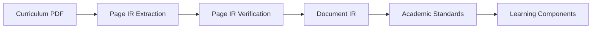

<h1 style="
  text-align: center;
  font-size: 1.5rem;
  font-weight: 700;
  color: #5480cb;
  margin: 1rem 0 0.25rem 0;
">
Transforming curriculum documents into source-grounded knowledge graphs
</h1>

This project provides a configurable pipeline for transforming curriculum PDFs into
structured, provenance-preserving knowledge graph artifacts aligned to the
[Learning Commons ontology](https://docs.learningcommons.org/knowledge-graph/understanding-knowledge-graph/introduction).

The pipeline separates **source reconstruction** from **curriculum-semantic
interpretation** so that each stage can be inspected, validated, and audited
independently.

## Pipeline at a glance

The five conceptual stages are:

1. **Page IR Extraction** — reconstruct the visible structure of each PDF page.
2. **Page IR Verification** — verify likely cross-page continuations and conservatively
   update page-boundary metadata.
3. **Document IR** — deterministically stitch verified page structures into a
   document-level representation while preserving provenance.
4. **Academic Standards** — extract, reconcile, identify, hierarchize, and validate
   source-grounded standards.
5. **Learning Components** — decompose eligible standards into atomic skills, resolve
   duplicates, and connect them back to the standards they support.

The current implementation is document- and configuration-driven rather than tied to a
single curriculum or country.

[Architecture :octicons-arrow-right-24:](./architecture.md){ .md-button .md-button--secondary }
[Pipeline documentation :octicons-arrow-right-24:](./pipeline/index.md){ .md-button .md-button--primary }

---

## What the documentation covers

- **Architecture** explains the system boundaries, trust model, provenance strategy,
  deterministic invariants, and relationship between the major representations.
- **Pipeline** documents the operational flow from PDF extraction through the final
  Academic Standards + Learning Components graph.
- **Development** contains local development and contributor-oriented material.

!!! note
    The production pipeline currently builds `hasChild` relationships within the
    Academic Standards hierarchy and `supports` relationships from Learning Components
    to Standards Framework Items. Other Learning Commons relationship types may exist in
    the shared schema but are not constructed by the current pipeline.

!!! question "Have a use case or feature request?"
    If you are working with curriculum data in government, education, research, or the
    social sector, we'd like to hear about the workflows this system should support.
    Raise an issue in the [project repository](https://github.com/IDinsight/SenegalKG) with
    `[FEATURE REQUEST]` in the title.

 
Built and powered by IDinsight.

IDinsight uses data and evidence to help leaders combat poverty worldwide. Our collaborations deploy a large analytical toolkit to help clients design better policies, rigorously test what works, and use evidence to implement effectively at scale. We place special emphasis on using the right tool for the right question, and tailor our rigorous methods to the real-world constraints of decision-makers. IDinsight works with governments, foundations, NGOs, multilaterals and businesses across Africa and Asia. We work in all major sectors including health, education, agriculture, governance, digital ID, financial access, and sanitation. We have offices in Dakar, Lusaka, Manila, Nairobi, New Delhi, Rabat, and Remote.
 
 
:globe_with_meridians: <a href="https://www.idinsight.org" class="link-home">www.idinsight.org</a>

