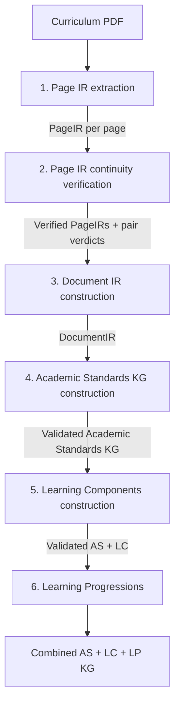
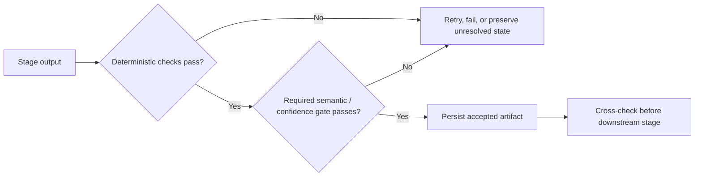

# Pipeline Overview

This page is the operational map of the curriculum-document processing pipeline. It
shows how a source PDF moves through the repository, which command owns each stage,
which artifacts form the handoff between stages, and where validation gates prevent
invalid upstream state from silently propagating downstream.

For the higher-level design principles behind these stages, see
[Architecture](../architecture.md).

---

## At a glance

The production pipeline has **six conceptual stages implemented through four main CLI
entry points**:



The first three stages reconstruct the source document with progressively broader
context. The final three stages perform curriculum-semantic interpretation and knowledge
graph construction.

---

## Command mapping

All four commands consume the same global runtime configuration file. Each command uses
the configuration namespace that belongs to its stage and cross-checks relevant
upstream artifacts before continuing.

| Conceptual stage                      | CLI entry point                                          | Main implementation package  | Primary handoff                                        |
|---------------------------------------|----------------------------------------------------------|------------------------------|--------------------------------------------------------|
| 1. Page IR extraction                 | `backend/src/kgfeg/entries/extract_page_ir.py`           | `kgfeg.page_ir_extraction`   | `extraction/page_irs/*.json`                           |
| 2. Page IR continuity verification    | `backend/src/kgfeg/entries/verify_page_ir_continuity.py` | `kgfeg.page_ir_verification` | `verification/page_irs_verified/*.json` + pair reports |
| 3. Document IR construction           | `backend/src/kgfeg/entries/stitch_document_ir.py`        | `kgfeg.document_ir`          | `stitching/document_ir.json`                           |
| 4. Academic Standards KG construction | `backend/src/kgfeg/entries/create_kgs.py`                | `kgfeg.kgs.sfi_*`            | `kgs/as_kg_bundle.json`                                |
| 5. Learning Components construction   | `backend/src/kgfeg/entries/create_kgs.py`                | `kgfeg.kgs.lc_*`             | `kgs/as_lc_kg_bundle.json`                             |
| 6. Learning Progressions construction | `backend/src/kgfeg/entries/create_kgs.py`                | `kgfeg.kgs.lp_*`             | `kgs/as_lc_lp_kg_bundle.json`                          |

From the `backend/` directory, a complete run follows this order:

```bash
python src/kgfeg/entries/extract_page_ir.py <config.json>
python src/kgfeg/entries/verify_page_ir_continuity.py <config.json>
python src/kgfeg/entries/stitch_document_ir.py <config.json>
python src/kgfeg/entries/create_kgs.py <config.json>
```

`create_kgs.py` owns all three KG phases: AS → LC → LP. Each consumes the validated
upstream bundle. The separate [LP evaluator](../guides/evaluating-learning-progressions.md)
uses `evaluate_lps.py RESULTS_ROOT` after completed snapshots are available; it is not
a production stage or a prerequisite for production success.

---

## How the representation changes

Each stage expands context while constraining what the next stage is allowed to assume.

| Handoff                                     | What downstream code may rely on                                                                                            | What has **not** yet been asserted                       |
|---------------------------------------------|-----------------------------------------------------------------------------------------------------------------------------|----------------------------------------------------------|
| PDF → Page IR                               | Accepted page-local blocks, tables, figures, coordinates, visible codes, and boundary hints satisfy PageIR validation       | Document-wide continuity or curriculum hierarchy         |
| Page IR → verified Page IR                  | Adjacent-page continuation evidence has been independently evaluated and confidence-gated patches have been applied         | Document-level stitched segments or curriculum semantics |
| Verified Page IR → DocumentIR               | Cross-page chains have been stitched, provenance is retained, and normalized source items are consumed exactly once         | Standards identities, hierarchy, or Learning Components  |
| DocumentIR → Academic Standards KG          | Source-grounded semantic extraction can operate over a stitched, provenance-preserving document representation              | Final standards identities or graph relationships        |
| Academic Standards KG → Learning Components | Standards identities, `hasChild` hierarchy, provenance, and AS validation have been resolved sufficiently for LC generation | Canonical atomic-skill identities                        |
| AS + LC KG → LP                             | Validated standards, hierarchy, LCs, supports, and retained provenance                                                      | Progression relationships                                |
| AS + LC + LP KG → consumers                 | Direct adjudicated LP edges and structural/process validation                                                               | Empirical prerequisite truth or pedagogical correctness  |

The main semantic boundary is between **Document IR construction** and **Academic
Standards construction**. `PageIR` and `DocumentIR` describe the source document;
Academic Standards construction is where the pipeline first asserts curriculum-specific
entity meaning.

---

## Runtime configuration

A run uses one `RunConfig`. Its stage-oriented namespaces mirror the pipeline:

```text
page_ir_extraction
page_ir_verification
document_ir
kgs
  as   # Academic Standards construction
  lc   # Learning Components construction
  lp   # Learning Progressions
  metadata # Framework metadata
```

The same source PDF and output root are shared across the run, while the stage-specific
configuration controls behavior, thresholds, and curriculum-specific policies. Model
selection is configured separately through the backend settings/environment.

The KG configuration is optional at the global schema level. Page extraction,
continuity verification, and DocumentIR construction can therefore be run without
constructing a knowledge graph. When `kgs` is supplied, `as`, `lc`, `lp`, and `metadata`
are all required; LP cannot be silently omitted.

---

## Result directory layout

The pipeline computes a stable document key from the configured source PDF and stores
stage outputs beneath that document-specific directory:

```text
<output_dir>/<doc_key>/
├── extraction/
│   ├── extraction_run.json
│   ├── page_images/
│   ├── page_irs/
│   └── page_irs_raw/
├── verification/
│   ├── verification_run.json
│   ├── page_irs_verified/
│   ├── page_irs_pair_reports/
│   ├── page_irs_pair_crops/
│   ├── continuity_compile_report.json
│   └── postprocess_report.json
├── stitching/
│   ├── stitching_run.json
│   ├── document_ir.json
│   └── stitch_report.json
└── kgs/
    ├── kg_run.json
    ├── kg_run_manifest.json
    ├── ... Academic Standards working artifacts ...
    ├── as_kg_bundle.json
    ├── as_validation_report.json
    ├── ... Learning Component working artifacts ...
    ├── lc_generation_draft_responses.jsonl
    ├── lc_generation_validation_verdicts.jsonl
    ├── learning_components.jsonl
    ├── lc_supports_edges.json
    ├── lc_generation_summary.json
    ├── as_lc_kg_bundle.json
    ├── as_lc_nodes.jsonl
    ├── as_lc_relationships.jsonl
    ├── ... Learning Progressions working artifacts ...
    ├── lp_generation_summary.json
    ├── lp_validation_report.json
    ├── as_lc_lp_kg_bundle.json
    ├── as_lc_lp_nodes.jsonl
    └── as_lc_lp_relationships.jsonl
```

Intermediate files are intentional pipeline artifacts. They preserve evidence and
working decisions needed for audit, debugging, review, and resumable processing.

For downstream ingestion, wire-format differences, identifier semantics, and guidance
on which files should become integration dependencies, see the
[output artifacts and integration contract](../reference/output-artifacts.md).

---

## Stage 1: Page IR extraction

**Purpose:** convert each selected PDF page into a structured, layout-faithful `PageIR`
without assigning curriculum semantics.

The command renders each page to an image and runs the Page IR extraction pipeline.
Optional PyMuPDF text/table information may be supplied as hints, but the rendered page
remains the visual source of truth. Accepted PageIRs can represent blocks, lists,
tables, figures, captions, coordinates, visible local codes, and page-boundary hints.

The extraction result passes deterministic structural validation and an LLM
validation/correction flow before it becomes the accepted page artifact.

**Primary handoff:**

```text
extraction/page_irs/<page_index>.json
```

**Audit starting points:** `extraction/page_images/`, `extraction/page_irs_raw/`, and
`extraction/extraction_run.json`.

**Downstream gate:** the accepted PageIR set must match the configured source document
and selected page range.

---

## Stage 2: Page IR continuity verification

**Purpose:** determine whether selected content at the end of page `N` continues into
selected content at the beginning of page `N+1`.

For each adjacent page pair, deterministic logic builds a bounded candidate set around
the page break. The continuity verifier evaluates those candidates independently of the
existing extraction boundary labels, and an independent validator checks the semantic
verdict. Deterministic confidence gates decide whether verified continuity evidence may
patch the canonical PageIRs.

This stage is specifically a **cross-page continuity** pass; it is not a general
re-extraction or whole-page correctness pass.

**Primary handoff:**

```text
verification/page_irs_verified/<page_index>.json
verification/page_irs_pair_reports/<page_N>_<page_N+1>.json
```

**Audit starting points:** the corresponding `page_irs_pair_crops/`,
`continuity_compile_report.json`, `postprocess_report.json`, and
`verification_run.json`.

**Downstream gate:** verified PageIRs and pair verdicts must cross-check against the same
source document and extraction run.

---

## Stage 3: Document IR construction

**Purpose:** deterministically stitch verified page-local structures into one
provenance-preserving `DocumentIR`.

The stitcher normalizes page items, computes page-break links, follows continuation
chains, and materializes document-level segments. It can merge text/list continuations
and reconstruct tables across page boundaries. No new semantic LLM pass is introduced
at this stage.

Every normalized source item must be consumed exactly once, and stitched segments retain
source provenance.

**Primary handoff:**

```text
stitching/document_ir.json
```

**Audit starting points:** `stitching/stitch_report.json` and
`stitching/stitching_run.json`.

**Downstream gate:** the DocumentIR must be valid, tied to the expected document key,
and traceable to the verified PageIR source items.

---

## Stage 4: Academic Standards KG construction

**Purpose:** transform source-grounded DocumentIR content into a validated Academic
Standards graph.

This is the first curriculum-semantic stage. The first KG phase in `create_kgs.py`:

1. plans source units and bounded extraction windows;
2. extracts source-grounded Standards Framework Item (SFI) candidates;
3. builds a global candidate registry;
4. resolves potential duplicate identities;
5. deterministically mints finalized SFIs;
6. resolves source-grounded `hasChild` relationships; and
7. compiles and validates the Academic Standards KG.

Higher-risk semantic operations use independent producer/checker LLM flows. Python owns
source-window planning, candidate registries, deterministic identity, graph invariants,
and final export validation.

**Primary handoff:**

```text
kgs/as_kg_bundle.json
```

**Audit starting points:** `sfi_extraction_*`, `sfi_candidate_registry.json`,
`sfi_merge_*`, `sfi_final_records.json`, `has_child_*`, `as_unresolved_items.json`,
`as_entity_provenance.json`, and `as_validation_report.json`.

**Downstream gate:** LC generation is downstream of the compiled Academic Standards
bundle and its validation/unresolved-item checks. Learning Components do not bypass this
layer and independently reinterpret the original PDF.

---

## Stage 5: Learning Components construction

**Purpose:** derive reusable atomic skills from eligible Academic Standards and connect
them back to the standards they support.

The second KG phase in `create_kgs.py`:

1. gates LC construction on the validated Academic Standards bundle;
2. deterministically selects eligible source SFIs;
3. builds hierarchy-aware generation requests, including multi-parent ancestor context;
4. produces atomic-skill decompositions and independently validates/corrects them;
5. groups exact and optional semantic duplicate skills within a configured scope;
6. deterministically mints canonical `LearningComponent` nodes;
7. creates `supports` relationships back to every claiming SFI;
8. validates LC coverage, identity, provenance, and relationship invariants; and
9. compiles and validates the combined Academic Standards + Learning Components graph.

The Academic Standards graph is authoritative for seed text and hierarchy context. LC
construction does not independently reinterpret the original PDF.

LC decomposition uses an independent **producer/checker** LLM flow. The producer creates
a complete decomposition, and a separate validator re-decomposes the seed from the
bounded request and either accepts the draft or returns a complete corrected response.
Python enforces request/SFI coverage, configured skill-count and text-length bounds,
identifier determinism, and final reconciliation.

The generic decomposition policy treats an already atomic standard as a valid one-skill
case, requires skills to remain directly supported by the seed, and prevents
combinatorial over-splitting: when a seed names several actions over several objects,
the model splits on one axis rather than generating an action-by-object cross product.
Sibling context can help avoid overlap but cannot license new skill content.

Semantic LC deduplication uses a different trust pattern: deterministic blocking
nominates candidate pairs and a bounded semantic judge adjudicates them with Python
coverage/retry checks. Exact identity normalization remains language-independent;
optional language packs affect candidate nomination only, not LC identity. Dedup scope
can be framework-wide, based on the complete top-ancestor set, based on the complete
direct-parent set, or isolated per source SFI. Unresolved hierarchy falls back to the
seed UUID under scoped modes so it cannot enable a cross-seed merge.

Canonical skills are minted as content-addressed deterministic UUIDv5
`LearningComponent` entities. Claim-level provenance is retained, and one deterministic
primary `supports` edge is emitted per LC/claiming-SFI pair. If one SFI contributes
several merged wordings to the same LC, the edge uses the minimum contributing claim
confidence.

Run-level reconciliation requires every eligible SFI to be accounted for exactly as
either claimed by at least one LC or recorded as a decomposition failure. The merged
bundle is then validated again for endpoints, edge coverage, identifier collisions,
provenance presence, and summary-count alignment.

**Primary handoff:**

```text
kgs/as_lc_kg_bundle.json
kgs/as_lc_nodes.jsonl
kgs/as_lc_relationships.jsonl
```

**Audit starting points:** `lc_eligibility_report.json`,
`lc_generation_requests.jsonl`, `lc_generation_draft_responses.jsonl`,
`lc_generation_validation_verdicts.jsonl`, `lc_generation_responses.jsonl`,
`lc_generation_failures.json`, `lc_dedup_*`, `learning_components.jsonl`,
`lc_supports_edges.json`, `lc_entity_provenance.json`, and
`lc_generation_summary.json`.

---

## Stage 6: Learning Progressions construction

**Purpose:** add within-framework SFI-to-SFI developmental and conceptual relationships.

LP consumes the validated AS+LC bundle, selects eligible SFIs using `kgs.lp`, nominates
bounded deterministic candidates, freezes requests, and runs a producer/checker flow.
Python owns endpoint/coverage checks, deterministic IDs, counts, provenance, relation
exclusivity, and whole-graph acyclicity. No upstream nodes or relationships are replaced.

**Primary handoff:** `kgs/as_lc_lp_kg_bundle.json`, `kgs/as_lc_lp_nodes.jsonl`, and
`kgs/as_lc_lp_relationships.jsonl`. The JSONL uses internal snake_case records, unlike
the AS/AS+LC delivery wire pairs.

**Audit starting points:** `lp_eligibility_report.json`, `lp_candidate_pairs.jsonl`,
`lp_generation_requests.jsonl`, draft/verdict/response checkpoints, failures and usage,
`lp_final_claims.json`, `lp_relationship_provenance.json`, `lp_unresolved_items.json`,
and `lp_validation_report.json`.

`needs_review` is nonpublishing and nonblocking; any unresolved processing failure
blocks LP/combined success. Bounded concurrency defaults to four requests, with durable
pending completions and active-call drain after exhausted failure. With
`kgs.overwrite=false`, stale material is rejected during resume or reuse. Separately
authorized regeneration with `kgs.overwrite=true` can rebuild affected stages when the
existing checkpoint format is supported; the new evidence must pass validation.
Unsupported checkpoint formats are always rejected before calls or artifact changes,
including when overwrite is enabled. See
[Learning Progressions](learning-progressions.md) for the full contract.

---

## Validation and failure containment

A model response or upstream artifact must pass each stage's explicit check gates
before downstream state can depend on it.



Across the pipeline, Python is responsible for contracts such as schemas, coordinates,
confidence gates, exact source-item consumption, deterministic identities, graph
endpoints and cardinality, cycle/reachability checks, provenance reconciliation, and
run-level summaries. LLMs provide bounded visual or semantic judgments within those
contracts.

Where the KG pipeline cannot safely finalize a semantic decision, it preserves
unresolved/review state instead of silently fabricating a canonical answer.

---

## Current graph scope

The current production path creates:

- `StandardsFramework` nodes;
- `StandardsFrameworkItem` nodes;
- `LearningComponent` nodes;
- `hasChild` relationships among Academic Standards entities;
- `supports` relationships from Learning Components to Standards Framework Items; and
- `buildsTowards` and `relatesTo` relationships between SFIs in the same framework.

`relatesTo` requires symmetric lookup. `buildsTowards` is not a strict prerequisite,
and computed reachability is not another published edge. See
[relationship semantics](learning-progressions.md#relationship-meaning-and-consumer-queries).

---

## Where to inspect a run

When debugging, start with the artifact closest to the stage where behavior diverged.
For resume behavior, overwrite decisions, partial-run recovery, and rerun scope, see
[Run, Resume, and Debug](../guides/running-and-debugging.md).

| Question                                              | Start here                                                                                                    |
|-------------------------------------------------------|---------------------------------------------------------------------------------------------------------------|
| Was a page extracted incorrectly?                     | Accepted PageIR, corresponding page image, and `page_irs_raw/` attempts                                       |
| Was a page-break continuation classified incorrectly? | `page_irs_pair_reports/` and the corresponding pair crop                                                      |
| Was content stitched across pages incorrectly?        | `stitch_report.json` and `document_ir.json`                                                                   |
| Was a standard missed or extracted incorrectly?       | SFI extraction windows/results and `sfi_candidate_registry.json`                                              |
| Were two standards merged incorrectly?                | SFI merge report/groups/conflicts and dedup review artifacts                                                  |
| Was a standard assigned the wrong parent?             | `has_child_candidate_parent_sets.jsonl`, resolution artifacts, and `has_child_edges_final.json`               |
| Why was a standard excluded from LC generation?       | `lc_eligibility_report.json` and `lc_eligible_sfis.json`                                                      |
| Was a skill generated incorrectly?                    | `lc_generation_requests.jsonl`, producer drafts, validator verdicts, final responses, and failures            |
| Were two skills merged or kept separate incorrectly?  | `lc_dedup_candidate_pairs.jsonl`, `lc_dedup_verdicts.jsonl`, and `lc_dedup_groups.json`                       |
| Why was an LP pair omitted or classified this way?    | Eligibility, candidates, bounded requests, producer/checker judgments, and `lp_final_claims.json`             |
| Does the final graph reconcile?                       | AS/LP validation reports, LC/LP summaries, and all three bundles                                              |
| What does separate judge evidence say?                | `lp_eval_report.md` and JSON report, sample/condition denominators, failures, usage, and concern dispositions |

---

## Stage-specific documentation

Detailed documentation is organized around the same six conceptual stages:

```text
docs/pipeline/page-ir-extraction.md
docs/pipeline/page-ir-verification.md
docs/pipeline/document-ir.md
docs/pipeline/academic-standards.md
docs/pipeline/learning-components.md
docs/pipeline/learning-progressions.md
```

- [Learning Progressions](learning-progressions.md)
- [Separate LP evaluation](../guides/evaluating-learning-progressions.md)

These pages provide the implementation details, configuration behavior, validation
rules, and artifact contracts that this overview intentionally keeps concise.

---

## Next

[Page IR Extraction →](page-ir-extraction.md)
