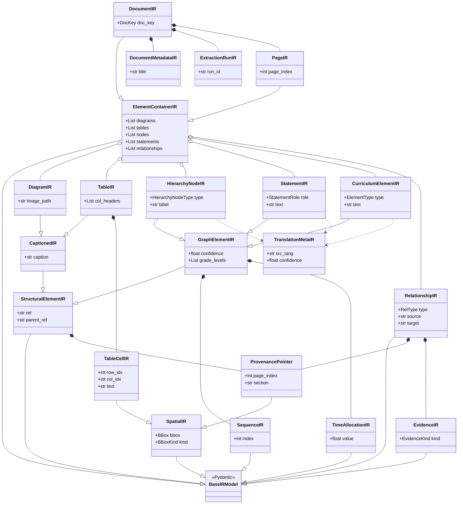

```mermaid
classDiagram
    direction TB

    %% ==========================================
    %% 1. PRIMITIVES
    %% ==========================================
    class BaseIRModel {
        <<Pydantic>>
    }

    class SpatialIR {
        +BBox bbox
        +BBoxKind kind
    }

    class ProvenancePointer {
        +int page_index
        +str section
    }

    class StructuralElementIR {
        +str ref
        +str parent_ref
    }

    class CaptionedIR {
        +str caption
    }

    class TranslationMetaIR {
        +str src_lang
        +float confidence
    }

    %% Relationships - Primitives
    SpatialIR --|> BaseIRModel
    StructuralElementIR --|> BaseIRModel
    ProvenancePointer --|> SpatialIR
    CaptionedIR --|> StructuralElementIR
    StructuralElementIR *-- ProvenancePointer

    %% ==========================================
    %% 2. PHYSICAL ELEMENTS
    %% ==========================================
    class DiagramIR {
        +str image_path
    }

    class TableIR {
        +List col_headers
    }

    class TableCellIR {
        +int row_idx
        +int col_idx
        +str text
    }

    %% Relationships - Physical
    DiagramIR --|> CaptionedIR
    TableIR --|> CaptionedIR
    TableCellIR --|> SpatialIR
    TableIR *-- TableCellIR

    %% ==========================================
    %% 3. LOGICAL ELEMENTS
    %% ==========================================
    class EvidenceIR {
        +EvidenceKind kind
    }

    class SequenceIR {
        +int index
    }

    class TimeAllocationIR {
        +float value
    }

    class GraphElementIR {
        +float confidence
        +List grade_levels
    }

    class HierarchyNodeIR {
        +HierarchyNodeType type
        +str label
    }

    class StatementIR {
        +StatementRole role
        +str text
    }

    class CurriculumElementIR {
        +ElementType type
        +str text
    }

    class RelationshipIR {
        +RelType type
        +str source
        +str target
    }

    %% Relationships - Logical
    EvidenceIR --|> BaseIRModel
    SequenceIR --|> BaseIRModel
    TimeAllocationIR --|> BaseIRModel
    
    GraphElementIR --|> StructuralElementIR
    GraphElementIR *-- SequenceIR
    GraphElementIR *-- TimeAllocationIR
    
    HierarchyNodeIR --|> GraphElementIR
    StatementIR --|> GraphElementIR
    CurriculumElementIR --|> GraphElementIR
    
    HierarchyNodeIR ..> TranslationMetaIR
    StatementIR ..> TranslationMetaIR
    CurriculumElementIR ..> TranslationMetaIR
    
    RelationshipIR --|> BaseIRModel
    RelationshipIR *-- ProvenancePointer
    RelationshipIR *-- EvidenceIR

    %% ==========================================
    %% 4. CONTAINERS
    %% ==========================================
    class ElementContainerIR {
        +List diagrams
        +List tables
        +List nodes
        +List statements
        +List relationships
    }

    class PageIR {
        +int page_index
    }

    class DocumentIR {
        +DocKey doc_key
    }

    class DocumentMetadataIR {
        +str title
    }

    class ExtractionRunIR {
        +str run_id
    }

    %% Relationships - Containers
    ElementContainerIR --|> BaseIRModel
    PageIR --|> ElementContainerIR
    DocumentIR --|> ElementContainerIR
    
    DocumentIR *-- DocumentMetadataIR
    DocumentIR *-- ExtractionRunIR
    DocumentIR *-- PageIR

    %% Aggregations
    ElementContainerIR o-- DiagramIR
    ElementContainerIR o-- TableIR
    ElementContainerIR o-- HierarchyNodeIR
    ElementContainerIR o-- StatementIR
    ElementContainerIR o-- CurriculumElementIR
    ElementContainerIR o-- RelationshipIR
```