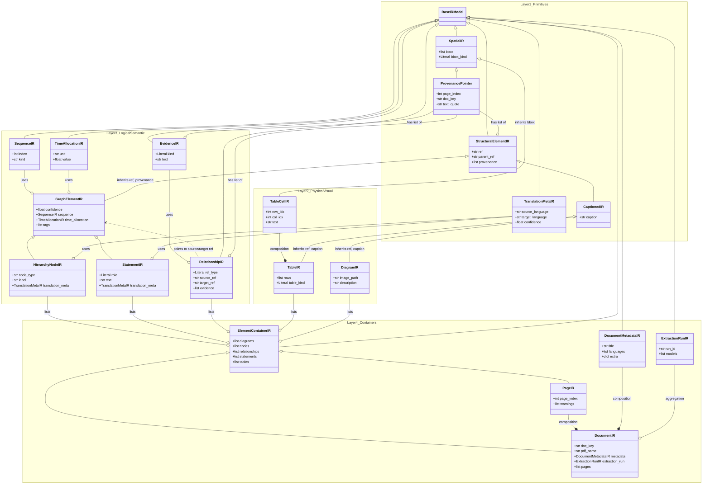

```mermaid
classDiagram
    %% --- LAYOUT DEFINITIONS ---
    direction BT
    %% Define specific styles for layers
    classDef primitives fill:#e1e1e1,stroke:#333,stroke-width:1px,color:black;
    classDef physical fill:#d4edda,stroke:#28a745,stroke-width:1px,color:black;
    classDef logical fill:#cce5ff,stroke:#007bff,stroke-width:1px,color:black;
    classDef containers fill:#fff3cd,stroke:#ffc107,stroke-width:1px,color:black;
    classDef helpers fill:#f8f9fa,stroke:#6c757d,stroke-dasharray: 5 5,color:black;

    %% ==========================================
    %% LAYER 4: CONTAINERS
    %% Packaging mechanisms and metadata
    %% ==========================================
    namespace Layer4_Containers {
        class DocumentIR:::containers {
            +str doc_key
            +str pdf_name
            +DocumentMetadataIR metadata
            +ExtractionRunIR extraction_run
            +list pages
        }
        class PageIR:::containers {
            +int page_index
            +list warnings
        }
        class ElementContainerIR:::containers {
            %% MIXIN: The bucket holding lists of items
            +list diagrams
            +list nodes
            +list relationships
            +list statements
            +list tables
        }
        class DocumentMetadataIR:::helpers {
            +str title
            +list languages
            +dict extra
        }
        class ExtractionRunIR:::helpers {
            +str run_id
            +list models
        }
    }

    DocumentIR --|> ElementContainerIR
    PageIR --|> ElementContainerIR
    DocumentIR *-- PageIR : composition
    DocumentIR *-- DocumentMetadataIR : composition
    DocumentIR o-- ExtractionRunIR : aggregation


    %% ==========================================
    %% LAYER 3: LOGICAL / SEMANTIC ELEMENTS
    %% The Knowledge Graph (Curriculum Standards)
    %% ==========================================
    namespace Layer3_LogicalSemantic {
        class RelationshipIR:::logical {
            %% The glue between graph elements
            +Literal rel_type
            +str source_ref
            +str target_ref
            +list evidence
        }
        class EvidenceIR:::logical {
            %% Supports relationships
            +Literal kind
            +str text
        }
        class StatementIR:::logical {
            %% The Payload (What students learn)
            +Literal role
            +str text
            +TranslationMetaIR translation_meta
        }
        class HierarchyNodeIR:::logical {
            %% The Scaffolding (Grade, Topic, etc.)
            +str node_type
            +str label
            +TranslationMetaIR translation_meta
        }
        class GraphElementIR:::logical {
            %% ABSTRACT: Contract for "Curriculum Item"
            +float confidence
            +SequenceIR sequence
            +TimeAllocationIR time_allocation
            +list tags
        }
        class SequenceIR:::helpers {
            +int index
            +str kind
        }
        class TimeAllocationIR:::helpers {
            +str unit
            +float value
        }
    }

    HierarchyNodeIR --|> GraphElementIR
    StatementIR --|> GraphElementIR
    RelationshipIR o-- EvidenceIR : uses
    GraphElementIR o-- SequenceIR : uses
    GraphElementIR o-- TimeAllocationIR : uses

    %% Relationship references via string IDs (weak linking)
    RelationshipIR ..> GraphElementIR : points to source/target ref

    %% Containers link down to Logical layer lists
    ElementContainerIR o-- HierarchyNodeIR : lists
    ElementContainerIR o-- StatementIR : lists
    ElementContainerIR o-- RelationshipIR : lists


    %% ==========================================
    %% LAYER 2: PHYSICAL / VISUAL ELEMENTS
    %% Raw artifacts on the PDF page
    %% ==========================================
    namespace Layer2_PhysicalVisual {
        class TableIR:::physical {
            %% Grids of data
            +list rows
            +Literal table_kind
        }
        class TableCellIR:::physical {
            %% Single cell spatial data
            +int row_idx
            +int col_idx
            +str text
        }
        class DiagramIR:::physical {
            %% Charts, images
            +str image_path
            +str description
        }
    }

    TableIR *-- TableCellIR : composition
    %% Containers link down to Physical layer lists
    ElementContainerIR o-- TableIR : lists
    ElementContainerIR o-- DiagramIR : lists


    %% ==========================================
    %% LAYER 1: PRIMITIVES
    %% Foundational mixins and base classes.
    %% The bridge between physical and semantic.
    %% ==========================================
    namespace Layer1_Primitives {
        class TranslationMetaIR:::helpers {
            +str source_language
            +str target_language
            +float confidence
        }
        class CaptionedIR:::primitives {
            %% BASE
            +str caption
        }
        class StructuralElementIR:::primitives {
            %% THE BRIDGE: Identity module unique ID + provenance
            +str ref
            +str parent_ref
            +list provenance
        }
        class ProvenancePointer:::primitives {
            %% The link back to the PDF source
            +int page_index
            +str doc_key
            +str text_quote
        }
        class SpatialIR:::primitives {
            %% MIXIN: The "Physics" module
            +list bbox
            +Literal bbox_kind
        }
        class BaseIRModel:::primitives {
            %% Root config enforcer
        }
    }

    %% Inheritance Hierarchy Bottom-Up
    SpatialIR --|> BaseIRModel
    ProvenancePointer --|> SpatialIR
    StructuralElementIR --|> BaseIRModel
    CaptionedIR --|> StructuralElementIR

    %% Linking Primitives up to Physical Layer
    TableCellIR --|> SpatialIR : inherits bbox
    TableIR --|> CaptionedIR : inherits ref, caption
    DiagramIR --|> CaptionedIR : inherits ref, caption

    %% Linking Primitives up to Logical Layer
    GraphElementIR --|> StructuralElementIR : inherits ref, provenance
    RelationshipIR --|> BaseIRModel
    EvidenceIR --|> BaseIRModel
    
    %% The ubiquitous use of ProvenancePointer (The Bridge realization)
    StructuralElementIR o-- ProvenancePointer : has list of
    RelationshipIR o-- ProvenancePointer : has list of
    EvidenceIR o-- ProvenancePointer : has list of

    %% Helpers inheriting base config
    TranslationMetaIR --|> BaseIRModel
    SequenceIR --|> BaseIRModel
    TimeAllocationIR --|> BaseIRModel
    DocumentMetadataIR --|> BaseIRModel
    ExtractionRunIR --|> BaseIRModel
    ElementContainerIR --|> BaseIRModel

    %% Translation Meta usage
    StatementIR o-- TranslationMetaIR : uses
    HierarchyNodeIR o-- TranslationMetaIR : uses
```